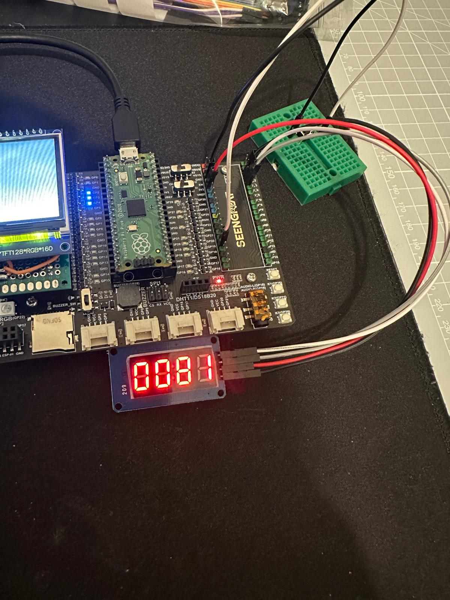

# TM1637 Library for Raspberry Pi Pico

This repository contains a C library for interfacing with the TM1637 4-digit 7-segment display using the Raspberry Pi Pico. The library provides functions to initialize the display, set brightness, display digits or numbers, and clear the display.



## Table of Contents

- [Features](#features)
- [Hardware Requirements](#hardware-requirements)
- [Getting Started](#getting-started)
  - [Prerequisites](#prerequisites)
  - [Cloning the Repository](#cloning-the-repository)
  - [Wiring Diagram](#wiring-diagram)
- [Usage](#usage)
  - [Including the Library](#including-the-library)
  - [Compiling the Project](#compiling-the-project)
- [Library API](#library-api)
  - [Functions](#functions)
- [Example Code](#example-code)
- [License](#license)
- [Acknowledgments](#acknowledgments)

## Features

- Easy-to-use API for the TM1637 display
- Supports setting display brightness
- Display individual digits or full numbers (0-9999)
- Clear the display
- Compatible with the Raspberry Pi Pico SDK

## Hardware Requirements

- Raspberry Pi Pico
- TM1637 4-digit 7-segment display module
- Connecting wires
- (Optional) Pull-up resistors (if not included on the TM1637 module)

## Getting Started

### Prerequisites

- [Raspberry Pi Pico SDK](https://github.com/raspberrypi/pico-sdk) installed and properly set up
- CMake version 3.13 or higher
- GCC compiler for ARM (e.g., `arm-none-eabi-gcc`)
- Build tools (`make`)

### Cloning the Repository

Clone this repository to your local machine:

```bash
git clone https://github.com/yourusername/tm1637-pico-library.git
```

Replace `yourusername` with your GitHub username or the appropriate URL.

### Wiring Diagram

Connect the TM1637 module to the Raspberry Pi Pico as follows:

| TM1637 Pin | Raspberry Pi Pico Pin |
| ---------- | --------------------- |
| VCC        | 3.3V (Pin 36)         |
| GND        | GND (Pin 38)          |
| DIO        | GPIO 3 (Pin 5)        |
| CLK        | GPIO 2 (Pin 4)        |

**Note:** You can change the GPIO pins used by modifying the `tm1637.h` file or by specifying different pins when initializing the library.

## Usage

### Including the Library

1. **Copy the Library Files:**

   Copy `tm1637.h` and `tm1637.c` into your project directory.

2. **Include the Header in Your Code:**

   In your `main.c` or any other source file where you want to use the library, include the header file:

   ```c
   #include "tm1637.h"
   ```

### Compiling the Project

Your `CMakeLists.txt` file should include the `tm1637.c` source file and link against the necessary libraries.

#### Example `CMakeLists.txt`

```cmake
cmake_minimum_required(VERSION 3.13)

# Include the Pico SDK
include($ENV{PICO_SDK_PATH}/external/pico_sdk_import.cmake)

project(tm1637_project)

# Initialize the Pico SDK
pico_sdk_init()

# Add executable and include source files
add_executable(tm1637_project
    main.c      # Your main application file
    tm1637.c    # The tm1637 library source file
)

# Link against Pico libraries
target_link_libraries(tm1637_project
    pico_stdlib
    hardware_gpio
)

# Enable USB output (optional)
pico_enable_stdio_usb(tm1637_project 1)
pico_enable_stdio_uart(tm1637_project 0)

# Create map/bin/hex/uf2 files
pico_add_extra_outputs(tm1637_project)
```

#### Building the Project

1. Create a build directory:

   ```bash
   mkdir build
   cd build
   ```

2. Run CMake configuration:

   ```bash
   cmake ..
   ```

3. Build the project:

   ```bash
   make
   ```

4. The UF2 file will be generated in the build directory. Copy it to the Raspberry Pi Pico's storage to flash the firmware.

## Library API

### Functions

#### `void tm1637_init(uint gpio_clk, uint gpio_dio);`

Initializes the TM1637 display with the specified GPIO pins.

- `gpio_clk`: GPIO pin connected to the CLK pin of TM1637.
- `gpio_dio`: GPIO pin connected to the DIO pin of TM1637.

#### `void tm1637_set_brightness(tm1637_brightness_t brightness);`

Sets the brightness of the display.

- `brightness`: Brightness level (0 to 7).

#### `void tm1637_display_digit(uint8_t position, uint8_t digit);`

Displays a single digit at the specified position.

- `position`: Position on the display (0 to 3).
- `digit`: Digit to display (0 to 9).

#### `void tm1637_display_number(int number);`

Displays a number on the display.

- `number`: Number to display (0 to 9999).

#### `void tm1637_clear_display(void);`

Clears the display by turning off all segments.

## Example Code

Here's an example of how to use the library in your `main.c`:

```c
#include "pico/stdlib.h"
#include "tm1637.h"

int main() {
    stdio_init_all();

    // Initialize the TM1637 display
    tm1637_init(2, 3); // Use GPIO 2 for CLK and GPIO 3 for DIO

    // Set display brightness (0 to 7)
    tm1637_set_brightness(4);

    // Display a number
    tm1637_display_number(1234);

    // Main loop
    while (true) {
        // Increment and display numbers
        for (int i = 0; i <= 9999; i++) {
            tm1637_display_number(i);
            sleep_ms(500);
        }

        // Clear the display
        tm1637_clear_display();
        sleep_ms(1000);
    }

    return 0;
}
```

## License

This project is licensed under the MIT License - see the [LICENSE](LICENSE) file for details.

## Acknowledgments

- Inspired by various TM1637 libraries and tutorials.
- Special thanks to the Raspberry Pi Foundation for the Pico SDK.
